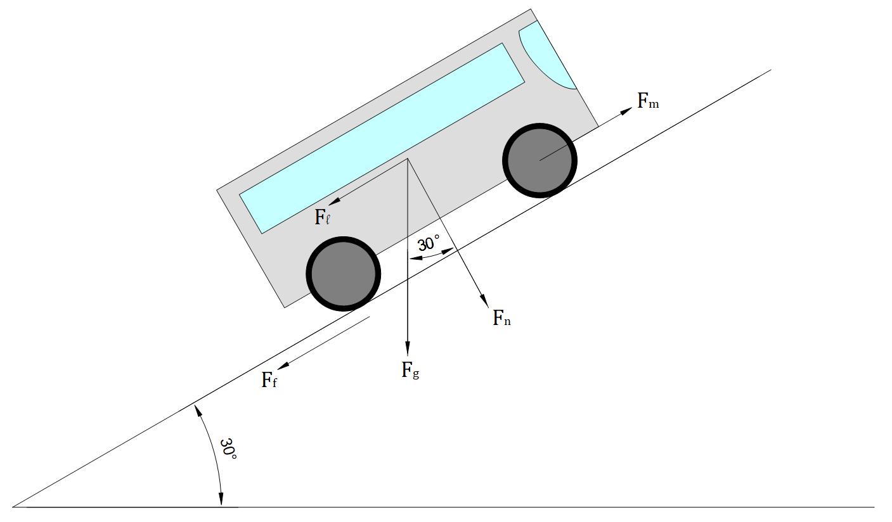

# Power Analysis of Electric Bus
This repository contains the code snippets for the power analysis of an electrical bus under various loading scenarios, weather conditions and vehicle parameters.

## Problem Statement
Consider a front wheel driven electric bus travelling uphill a slope of 30&deg;. The mass of the bus is 16.2 tonnes and the total capacity of the bus is 50 passengers (excluding the driver). Assume average mass of each person to be 75 kg. Consider the following motor parameters: number of stator poles, P = 4; armature resistance, Ra = 20 k&ohm; and armature current, Ia = 5 A. Analyze the power required by the bus for diffenent loading conditions (no passengers (only driver), half passengers and all passengers) for the following conditions:
* **Weather conditions:** &mu; = 0.2, 0.3, 0.4, 0.5, 0.6, 0.7 and 0.8
* **Wheel radius:** r = 0.35 m, 0.4 m, 0.45 m and 0.5 m
* **Vehicle speed:** v = 30 kmph, 40 kmph, 50 kmph and 60 kmph

## Results

| **No Passengers**   |  |  |  |
| :------------------ | :--------------------------------------------------------------------: | :----------------------------------------------------------: | :--------------------------------------------------------------------: |
| **Half Passengers** |  |  |  |
| :------------------ | :--------------------------------------------------------------------: | :----------------------------------------------------------: | :--------------------------------------------------------------------: |
| **All Passengers**  |  |  |  |

## Inference
Following points were inferred from the Analysis of Electric Bus assignment:
* **Loading the Bus:** Loading the bus refers to number of passengers aboard. As the number of passengers increased, the total mass of the system increased, which increased the gravitational force acting on the system. Thus, the load force and normal force, which are the resolved components of gravitational force, also increased. This caused increase in the motor force, and hence the power requirement also increased.
* **Weather Condition:** As the weather conditions varied, the coefficient of friction changed. Since frictional force is directly proportional to the coefficient of friction, an increase in coefficient of friction caused an increase in the frictional force. This caused increase in the motor force, and hence the power requirement also increased.
* **Wheel Radius:** Torque is directly proportional to the wheel radius while angular velocity is inversely proportional to the wheel radius. Hence an increase in wheel radius caused an increase in torque but a reduction in angular velocity (at the same rate). Thus, power requirement, which is product of the two remained constant.
* **Vehicle Speed:** The angular velocity is directly proportional to the vehicle speed. Hence an increase in vehicle speed caused an increase in the angular velocity and hence the power requirement also increased.
